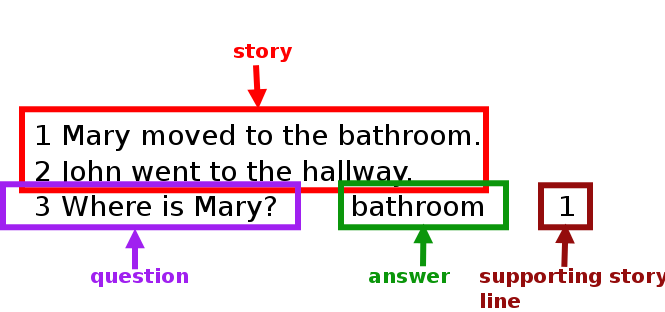
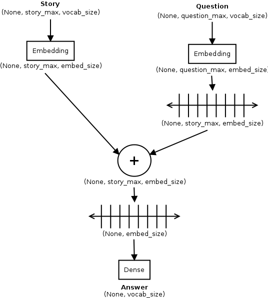
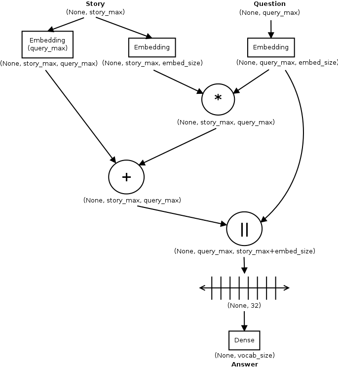
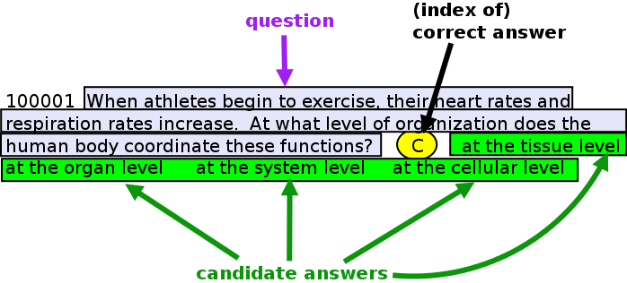
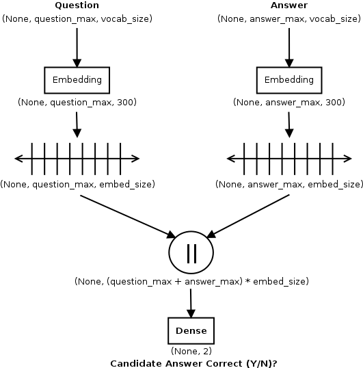
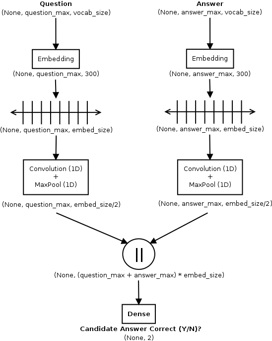
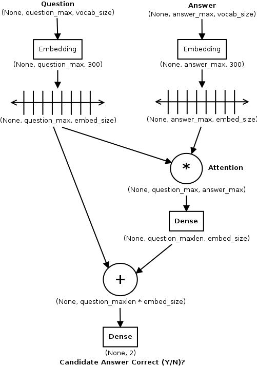
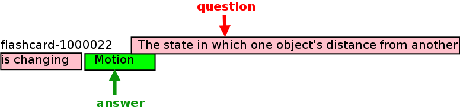
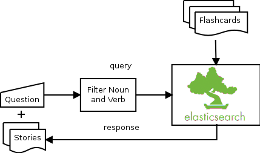
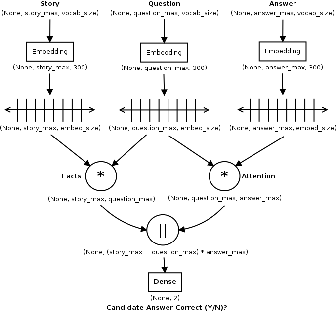

# dl-models-for-qa

## Table of Contents

* [Introduction](#introduction)
* [Models](#models)
  * [Models using bAbI dataset](#models-using-babi-dataset)
  * [BABI-LSTM](#babi-lstm)
  * [BABI-MEMNN](#babi-memnn)
  * [Models using Kaggle dataset](#models-using-kaggle-dataset)
  * [QA-LSTM](#qa-lstm)
  * [QA-LSTM CNN](#qa-lstm-cnn)
  * [QA-LSTM with Attention](#qa-lstm-with-attention)
  * [Incorporating External Knowledge](#incorporating-external-knowledge)
  * [QA-LSTM with Attention and Custom Embedding](#qa-lstm-with-attention-and-custom-embedding)
  * [QA-LSTM with Story](#qa-lstm-with-story)
* [Data](#data)
* [Results](#results)
* [Model deployment](#model-deployment)

## Introduction

This repository contains Python code to train and deploy Deep Learning (DL) models for Question Answering (QA). The code accompanies a talk I gave at the Question Answering Workshop organized by the Elsevier Search Guild.

Code is in Python. All the models are built using the awesome [Keras](https://keras.io/) library. Supporting code also uses [gensim](https://radimrehurek.com/gensim/), [NLTK](http://www.nltk.org/) and [Spacy](https://spacy.io/).

Objective of the code was to build DL model(s) to answer 8th grade multiple-choice science questions, provided as part of this [AllenAI competition on Kaggle](Thttps://www.kaggle.com/c/the-allen-ai-science-challenge).

## Models

Much of the inspiration for the DL implementations in this project came from the [solution posted](https://github.com/tambetm/allenAI) by the 4th place winner of the competition, who used DL models along with traditional Information Retrieval (IR) models.

### Models using bAbI dataset

In order to gain some intuition about how to use DL for QA, I looked at two examples from the Keras examples, that use the single supporting fact (task #1) from the [bAbI dataset](https://research.facebook.com/research/babi/) created by Facebook. These two models are described below:

The bAbI dataset can be thought of as (story, question, answer) triples. In case of task #1, the answer is always a single word. Figure below illustrates the data format for task #1. 

Both models attempt to predict the answer as the most probable word from the entire vocabulary.

### BABI-LSTM

Implementation based on paper [Towards AI-Complete Question Answering: A set of Prerequisite Toy Tasks](http://arxiv.org/abs/1502.05698) - Weston, et al. Adapted from similar example in Keras examples.

Embedding is computed inline using story and patient. Observed accuracy (56%) is similar to that reported in paper (50%).

### BABI-MEMNN

Implementation based on paper [End to End Memory Networks](http://arxiv.org/abs/1503.08895) - Sukhbaatar, Szlam, Weston and Fergus. Adapted from similar example in Keras examples.

Accuracy achieved by implementation (on 1k triples) is around 42% compared to 99% reported in paper.

### Models using Kaggle dataset

From this point on, all our models use the competition dataset. A training set record is composed of (question, answer\_A, answer\_B, answer\_C, answer\_D, correct\_answer) tuples. Objective is to predict the index of the correct answer.

We can thus think of this as a classification problem, where we have 1 positive example and 3 negative examples for each training record.

### QA-LSTM

Implementation based on paper [LSTM-based Deep Learning Models for Non-factoid Answer Selection](https://arxiv.org/abs/1511.04108) - Tan, dos Santos, Xiang and Zhou. 

Unlike bABi models, embedding uses pre-trained Google News Word2Vec model to convert story and question input vector (1 hot sparse representation) into dense representation of size (300,).

Accuracy numbers from implementation are 56.93% with unidirectional LSTMs and 57% with bidirectional LSTMs.

### QA-LSTM CNN

Same as qa-lstm, but with an additional 1D Convolution/MaxPool layer to further extract the meaning of the question and answer.

Produces slightly worse accuracy numbers than QA-LSTM model - 55.7% with unidirectional LSTMs, did not try with bidirectional LSTMs.

### QA-LSTM with Attention

Problem with RNNs in general is the vanishing gradient problem. While LSTMs address the problem, they still suffer from it because of the very long distances involved in QA contexts. The solution to this is attention, where the network is forced to look at certain parts of the context and ignore (in a relative sense) everything else.

### Incorporating External Knowledge

Based on the competition message boards, there seems to be general consensus that external content is okay to use. Here are some mentioned:

* [ConceptNet](http://conceptnet5.media.mit.edu/)
* [CK-12 books](http://www.ck12.org/student/)
* [Quizlets](https://quizlet.com/)
* [Studystack Flashcards](http://www.studystack.com/)

Most of the contents mentioned involve quite a lot of effort to scrape/crawl the sites and parse the crawled content. There was one content source (Flashcards from StudyStack) that was [available here](https://drive.google.com/file/d/0B0fFJSGDUPcgUFJpTVl3QXhnNTQ/view?usp=sharing) in pre-parsed form, so I used that. This gave me 400k flashcard records, questions followed by the correct answer. I thought of this as the "story" from the bAbI context.

### QA-LSTM with Attention and Custom Embedding

My first attempt at incorporating the story was to replace the embedding from the pre-trained Word2Vec model with a Word2Vec model generated using the Flashcard data. This created a smaller, more compact embedding and gave me quite a good boost in accuracy.

| Model                              | Default Embedding | Story Embedding |
| -----------------------------------| ----------------- | --------------- |
| QA-LSTM w/Attention                | 62.93%            | 76.27%          |
| QA-LSTM bidirectional w/Attention  | 60.43%            | 76.27%          |

The qa-lstm-fem-attn model(s) are identical to the qa-lstm-attn model(s) except for the embedding used - instead of the default embedding from Word2Vec, I am now using a custom embedding from the flashcard data.

### QA-LSTM with Story

My second attempt at incorporating the story data was to try to create (story, question, answer) triples similar to the bAbI models. The first step is to load the flashcards into an Elasticsearch (ES) index, one flashcard per record. For each question, the nouns and verbs are filtered and an OR query constructed and sent to ES. The top 10 flashcards retrieved for each question become the story for that triple.

Once I have the "story" associated with our (question, answer) pairs, I construct a network as shown below. This model did not perform as well as the QA-LSTM with Attention models, accuracy was 70.47% with unidirectional LSTMs and 61.77% with bidirectional LSTMs.

## Results

Results from the various QA-LSTM variants against the Kaggle dataset is summarized below.

| Model Specifications                                 | Test Acc. (%) |
| ---------------------------------------------------- | ------------- |
| QA-LSTM (Baseline)                                   | 56.93         |
| QA-LSTM Bidirectional                                | 57.0          |
| QA-LSTM + CNN                                        | 55.7          |
| QA-LSTM with Attention                               | 62.93         |
| QA-LSTM Bidirectional with Attention                 | 60.43         |
| QA-LSTM with Attention + Custom Embedding            | 76.27         |
| QA-LSTM Bidirectional w/Attention + Custom Embedding | 76.27         |
| QA-LSTM + Attention + Story Facts                    | 70.47         |
| QA-LSTM Bidirectional + Attention + Story Facts      | 61.77         |

## Data

Data is not included in this project. However, most of the data is available on the Internet, I have included links to the data where applicable. The code expects the following directory structure.

    PROJECT_HOME
       |
       +---- data
       |       |
       |       +---- babi_data
       |       |
       |       +---- comp_data
       |       |
       |       +---- models

The bAbI dataset is available from [this URL]. Download it and expand the tarball under the babi\_data directory.

My code uses the **original dataset** provided along with the competition, which is no longer available (and cannot be distributed). However, AllenAI provides an [alternative dataset](http://allenai.org/data.html) which can be used instead. These files need to be copied into the comp\_data subdirectory. Note that the format of the new data is slightly different, but fortunately well documented, so you will have to adapt the parsing logic in kaggle.py. Look for the following verbiage to find the correct dataset to download.

>    AI2 8th Grade Science Questions (No Diagrams)
>    641 questions February 2016 These question sets are derived from a variety of regional and state science exams.
>
>    These science exam questions guide our research into multiple choice question answering at the elementary science level. This download contains 8th grade-level multiple choice questions that do not incorporate diagrams.

The comp\_data directory should also contain the [GoogleNews Word2Vec model](https://drive.google.com/file/d/0B7XkCwpI5KDYNlNUTTlSS21pQmM/edit?usp=sharing), which is needed to load the default word vectors. In addition, the [StudyStack Flashcards](https://drive.google.com/file/d/0B0fFJSGDUPcgUFJpTVl3QXhnNTQ/view?usp=sharing) should also be downloaded and exploded in the same directory.

The models directory is used to hold the models that are written out by the different models when they run. The deploy code uses these models to make predictions. Models are not checked into github because of space considerations.

## Model deployment

TODO
